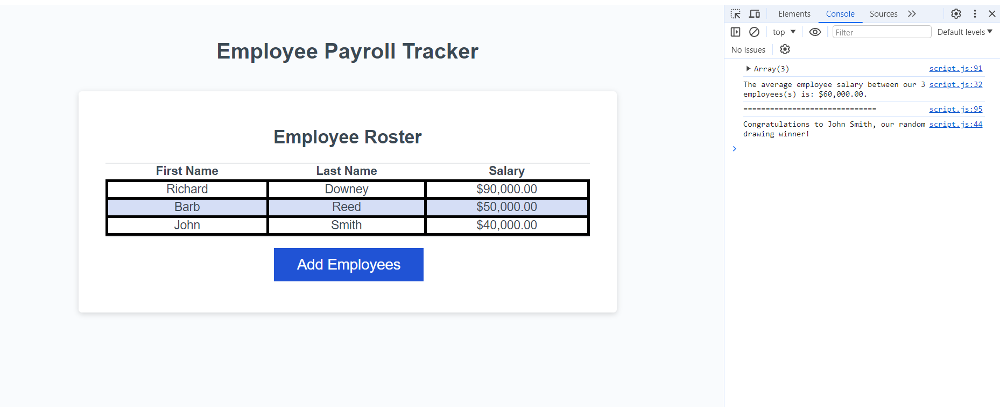

# <Your-Project-Title>

## Description

This project demonstrates understanding of JavaScript to display employee information provided by the user. The information displayed shows the information inputted by the user for the table of employees, as well as math equations in the console of the average salary and displaying a randomly generated employee. 

## Usage

Screenshot of employee table:
    
    
Screenshot of console:
    

## Credits

List your collaborators, if any, with links to their GitHub profiles.

If you used any third-party assets that require attribution, list the creators with links to their primary web presence in this section.

If you followed tutorials, include links to those here as well.

## License

Refer to license in repo. 

---

## How to Contribute

If you created an application or package and would like other developers to contribute it, you can include guidelines for how to do so. The [Contributor Covenant](https://www.contributor-covenant.org/) is an industry standard, but you can always write your own if you'd prefer.

## Tests

Go the extra mile and write tests for your application. Then provide examples on how to run them here.
